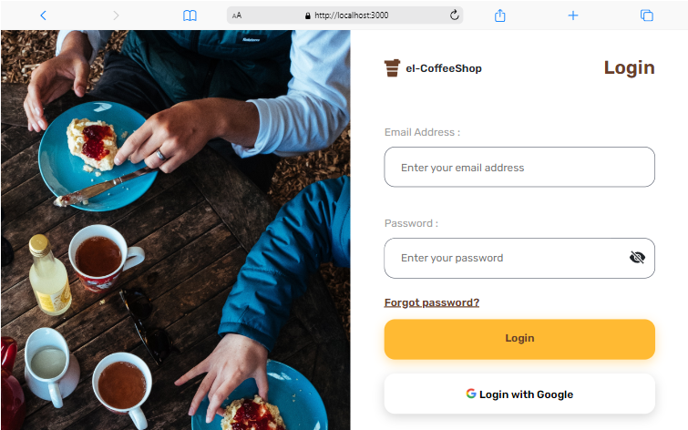
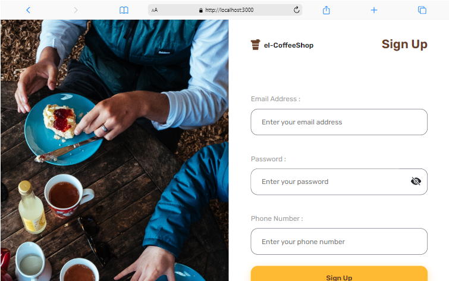
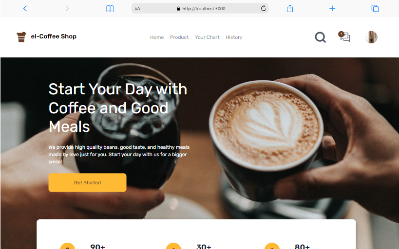
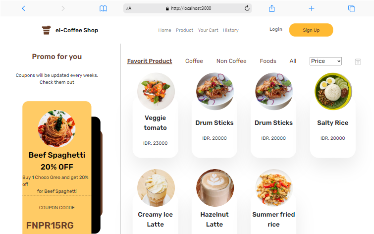
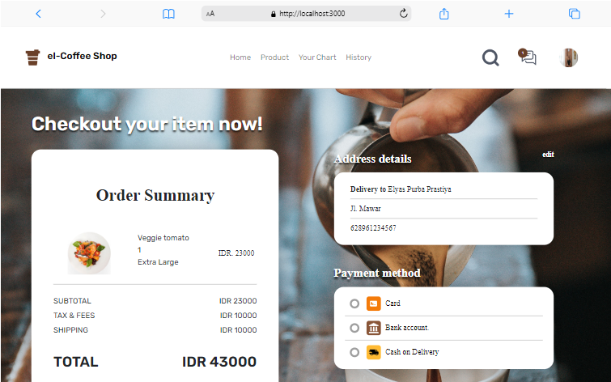

<p align="center">
  
</p>
<div align="center">
<h1>el-Coffee Shop</h1>
<p>el-Coffee Shop is a cool place to hang out with a cup of coffee.</p>
<br>
</div>

## 📍 About

Repository Frontend - el-Coffee Shop

Demo : [el-CoffeeShop](https://el-coffee-shop.netlify.app)

<br>

## 📌 How To Install?

-  Clone This Repo

```
git clone https://github.com/elyasprba/el-CoffeeShop-Frontend.git
```

-  Go To Folder Repo

```
cd el-coffeeshop
```

-  Install Module

```
npm install
```

-  Type `npm run start` To Start The Project
-  Set file .env `http://localhost:8080` from backend

<br>

## ⛏️ Built Using

-  [Axios](https://www.npmjs.com/package/axios)
-  [Bootstrap 5](https://getbootstrap.com/docs/5.0/getting-started/introduction/)
-  [React](https://reactjs.org/docs/getting-started.html)
-  [React-Bootstrap](https://www.npmjs.com/package/react-bootstrap)
-  [React-DOM](https://www.npmjs.com/package/react-dom)
-  [React-Bootsrap-Icons](https://www.npmjs.com/package/react-bootstrap-icons)
-  [React-Redux](https://www.npmjs.com/package/react-redux)
-  [React-Router-Dom](https://www.npmjs.com/package/react-router-dom)
-  [Redux](https://www.npmjs.com/package/redux)
-  [Redux-Logger](https://www.npmjs.com/package/redux-logger)
-  [Redux-Persist](https://www.npmjs.com/package/redux-persist)
-  [Redux-Thunk](https://www.npmjs.com/package/redux-thunk)
-  [Redux-Promise-Middleware](https://www.npmjs.com/package/redux-promise-middleware)

<br>

## 🔎 Preview Pages

  <span>
	
	
  
  
  
    <br/>
  </span>

<br>

## ✍️ el-CoffeeShop - Backend Link

https://github.com/elyasprba/el-coffeShop-backend.git

<br>
